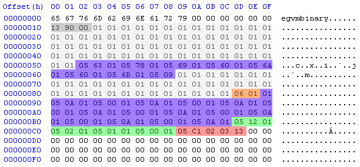

# SensePost Reversing Challenge
Date: 2014-06-01

Couple of weeks ago I have stumbled upon a [reversing challenge](http://sensepost.com/blog/10067.html) made by [SensePost](http://sensepost.com) earlier this year. I was not able to find any public solutions to it so I thought that it would be interesting to make one. Recently I had some spare time on my hands so I have decided to follow this goal. Enjoy.

# Initial analysis

After firing up IDA we can quickly pinpoint `main()` function which is located at `0x004016B0` (with base address as `0x00401000`). This binary is not obfuscated nor protected in any way, hence we can immediately spot interesting calls such as `fopen()`, `fgetc()`, `fread()`, and `strncmp()`. We will follow with top-down style analysis.

First thing that we see in `main()` is `fopen()` call which is checked for success at `0x004016DF`; if file opening operation was successful application proceeds with reading individual characters via `fgetc()` in a loop until position `0xFF` is passed or `EOF` is reached. These two checks look like this:

```
mov     eax, [esp+30h+fd]
mov     [esp+30h+input_ptr_loc], eax
call    fgetc
cmp     eax, 0FFFFFFFFh ; (fgetc() == EOF)?
jz      short loc_4
```

```
cmp     [esp+30h+counter], 0FFh
jle     short loc_4016F7
```

However, this loop is redundant. It does not affect any data that is later used. Next code block looks more interesting:

```
mov     eax, [esp+30h+fd]
mov     [esp+30h+var_24], eax ; src
mov     [esp+30h+var_28], 100h ; number of elements
mov     [esp+30h+tmp_ptr], 1 ; size of an element
mov     [esp+30h+input_ptr_loc], offset input_ptr ; dst
call    fread
```

We can clearly see that this code reads up `0x100` bytes from the file via `fread()` (this limits the size for a bytecode), then it starts preparing headers for comparison via `strncmp()` at `0x0040178D`.
After a quick study of surrounding code we can conclude that the header is `0x10` bytes long and it looks like this:

```
65 67 76 6D 62 69 6E 61 72 79 00 00 00 00 00 00
```

Due to the inner workings of `strncmp()` the header is validated only up to the first `NULL` byte (`man strncmp`).

When the header is successfully validated following block is hit:

```
mov     [esp+30h+input_ptr_loc], offset aHeaderMatched_
call    puts
call    loader
mov     [esp+30h+input_ptr_loc], eax
mov     [esp+30h+tmp_ptr], edx
call    executor
leave
retn
```

I have already re-named the two most important functions in this binary and their names are self-explanatory.

## loader() function

This function starts at `0x004017CD` and interesting things are right in the beginning:

```
mov     eax, [ebp+input_ptr_loc]
add     eax, 10h
movzx   eax, byte ptr [eax]
cmp     al, 10h
jbe     short loc_40182D ; JMP IF ([input_ptr_loc+0x10] <= 0x10)
```

It loads a value from a bytecode at offset `0x10` and then checks if it is below or equal to `0x10`. As can be seen in a jump to `True` node, this happens to be `IP` (instruction pointer). However, I would call it `EP` (entry point) as it is more precise. So, `EP` is at offset `0x10` in a bytecode and upon initialization it cannot be less than nor equal to `0x10`.
Next node does couple of things but the most important part is this:

```
mov     eax, [ebp+input_ptr_loc]
add     eax, 11h
movzx   eax, byte ptr [eax]
cmp     al, 4Fh
jbe     short loc_40187E ; JMP IF ([input_ptr_loc+0x11] <= 0x4F)
```

Similar mechanism and again when inspecting jump to `True` node we can find out what it is, namely `SP` (stack pointer). Hence, `SP` value is at offset `0x11` in a bytecode and upon initialization it cannot be less than nor equal to `0x4F`.

> Once the bytecode was validated and loaded, the user has the ability to change both IP and SP to arbitrary values via some trickery.

Code block at `0x00401845` does nothing interesting (it prints out some information about the stack (`SP` and first byte)).
Final block of this function looks like this:

```
mov     eax, [ebp+input_ptr_loc]
movzx   eax, byte ptr [eax+12h] ; [input_ptr_loc+0x12] happens to be LC (loop counter)
mov     byte ptr [ebp+tmp_ptr+2], al
mov     byte ptr [ebp+tmp_ptr+3], 0
mov     [esp+28h+string], offset aThreadContextI ; "\n\tThread context initialized, execution"...
call    puts
mov     eax, [ebp+input_ptr_loc] ; eax holds input_ptr_loc
mov     edx, [ebp+tmp_ptr] ; edx holds DWORD with \x00+LC+SP+IP
leave
retn
```

Apart from printing out thread context information it does two important things. First, it loads one additional value from a bytecode at offset `0x12`; this field was recognized later as `LC` (loop counter) and its existence is optional (required when a bytecode is using loops; can be crafted at runtime and SMC example takes advantage of that). Second, when returning it loads pointer to a bytecode in memory into `EAX` and it loads `IP`, `SP`, `LC`, `0x00` as `DWORD` value into `EDX`.

> All internal values (IP/SP/LC) are BYTE long and a bytecode is at most 0x100 in size. This makes sense, even if more data would be loaded the VM is limited with the registers size.

## executor() function

This function starts at `0x004018B8`. However, first things first:

```
mov     [esp+30h+input_ptr_loc], eax
mov     [esp+30h+tmp_ptr], edx
call    executor
```

That is why `EAX` and `EDX` were important when returning from `loader()` as both of them are used in `executor()` (passed as arguments).

Now, I will not go through each block of `executor()` function as most of them are easy enough to follow. I will focus on enumerating opcodes and describing associated code.

First interesting block is at the beginning of an opcode fetching loop and it looks like this:

```
mov     edx, [ebp+input_ptr_loc]
movzx   eax, [ebp+opcode_ptr]
movzx   eax, al
add     eax, edx
movzx   eax, byte ptr [eax] ; eax = [input_ptr_loc+opcode_ptr]
test    al, al
jnz     loc_4018C4
```

Opcode is being fetched from a location pointed by `input_ptr_loc+opcode_ptr` (`input_ptr_loc` is always equal to static address and `opcode_ptr` is equal to the `EP` on first iteration) and it is loaded into `EAX` and checked against `0x0` (which by itself happens to be our first valid opcode). From there you should be able to enumerate all opcodes by just following the conditions. They are as follows:

```
0x0 opcode = break/exit execution
0x1 opcode = stack pointer decrement
0x2 opcode = initialize loop (set loop_flag for 0x3 opcode and decrement LC)
0x3 opcode = takes care of jumping for freshly initialized loop
0x4 opcode = obfuscate current byte on stack with inversed current byte (byte on stack = NOT(byte))
0x5 opcode = obfuscate current byte on stack with opcode_ptr+1 (next byte to currently processed opcode), addition method
0x6 opcode = obfuscate current byte on stack with opcode_ptr+1 (next byte to currently processed opcode), substraction method
0xB opcode = print char
0x9 opcode = debugging flag
```

After each opcode (apart from opcodes `0x0` and `0x9`) `IP` is incremented by the following code:

```
movzx   eax, [ebp+opcode_ptr]
add     eax, 1
mov     [ebp+opcode_ptr], al
```

# Instruction set details

### Opcode 0x0

This opcode is responsible for termination. Length of this instruction is one byte (opcode).

```
mov     [esp+28h+var_28], 0Ah
call    putchar
add     esp, 24h
pop     ebx
pop     ebp
retn
```

### Opcode 0x1

This opcode is responsible for decrementing `SP`. Length of this instruction is one byte (opcode).

```
stack_pointer_decrement:
movzx   eax, [ebp+stack_pointer_loc]
sub     eax, 1
mov     [ebp+stack_pointer_loc], al
jmp     loc_401BE3
```

> SP is decremented hence the stack goes backward. This is important notion of this VM.

### Opcode 0x2

This opcode is responsible for loop initializing. Length of this instruction is one byte (opcode). There is an additional check made before initialization which verifies whether `LC` is set or not:

```
mov     eax, [ebp+input_ptr_loc]
movzx   eax, byte ptr [eax+12h]
mov     [ebp+loop_counter], al
movzx   eax, [ebp+loop_counter]
test    al, al
jz      short reset_loop_flag
```

If `LC` is set then it is decremented and `loop_flag` is set:

```
loop_init:
movzx   eax, [ebp+loop_counter]
sub     eax, 1
mov     [ebp+loop_counter], al
mov     eax, [ebp+input_ptr_loc]
lea     edx, [eax+12h]
movzx   eax, [ebp+loop_counter]
mov     [edx], al       ; [input_ptr_loc+0x12] = loop_counter-1
mov     [ebp+loop_flag], 1 ; set loop_flag
jmp     loc_401BE3
```

If `LC` is not set then `loop_flag` is NULLed and execution continues.

### Opcode 0x3

This opcode is responsible for jumping. Length of this instruction is two bytes (opcode, new `IP`). Because of an additional check it cannot be used as a stand-alone jump instruction (`loop_flag` needs to be set):

```
movzx   eax, [ebp+loop_flag]
test    al, al
jz      short skip_next_opcode
```

If `loop_flag` is set then new `IP` is initialized:

```
set_opcode_ptr:
mov     eax, [ebp+input_ptr_loc]
movzx   edx, [ebp+opcode_ptr]
movzx   edx, dl
add     edx, 1
add     eax, edx
movzx   eax, byte ptr [eax] ; eax = [input_ptr_loc+(opcode_ptr+1)]
sub     eax, 1
mov     [ebp+opcode_ptr], al ; opcode_ptr = [input_ptr_loc+(opcode_ptr+1)]-1
jmp     loc_401BE3
```

If `loop_flag` is not set it skips second byte with an additional `IP` increment:

```
skip_next_opcode:
movzx   eax, [ebp+opcode_ptr]
add     eax, 1
mov     [ebp+opcode_ptr], al
jmp     loc_401BE3
```

> Opcodes 0x2 and 0x3 are mutually connected. One cannot be used without the other.

### Opcode 0x4

This opcode is responsible for obfuscation. Length of this instruction is one byte (opcode). Byte currently pointed by `SP` is inverted:

```
obfuscate_stack_byte:
mov     edx, [ebp+input_ptr_loc]
movzx   eax, [ebp+stack_pointer_loc]
movzx   eax, al
add     eax, edx
mov     ecx, [ebp+input_ptr_loc]
movzx   edx, [ebp+stack_pointer_loc]
movzx   edx, dl
add     edx, ecx
movzx   edx, byte ptr [edx] ; edx = [input_ptr_loc+stack_pointer_loc]
not     edx
mov     [eax], dl       ; [input_ptr_loc+stack_pointer_loc] = NOT [input_ptr_loc+stack_pointer_loc]
jmp     loc_401BE3
```

### Opcode 0x5

This opcode is responsible for obfuscation. Length of this instruction is two bytes (opcode, byte to add). Byte currently pointed by `SP` is modified with a second byte of the instruction via addition:

```
obfuscate_stack_add:
movzx   eax, [ebp+opcode_ptr]
add     eax, 1
mov     [ebp+opcode_ptr], al ; opcode_ptr points to byte to add
mov     edx, [ebp+input_ptr_loc]
movzx   eax, [ebp+stack_pointer_loc]
movzx   eax, al
add     eax, edx
mov     ecx, [ebp+input_ptr_loc]
movzx   edx, [ebp+stack_pointer_loc]
movzx   edx, dl
add     edx, ecx
movzx   ecx, byte ptr [edx] ; ecx = [input_ptr_loc+stack_pointer_loc]
mov     ebx, [ebp+input_ptr_loc]
movzx   edx, [ebp+opcode_ptr]
movzx   edx, dl
add     edx, ebx
movzx   edx, byte ptr [edx] ; edx = [input_ptr_loc+opcode_ptr]
add     edx, ecx        ; edx = [input_ptr_loc+opcode_ptr] + [input_ptr_loc+stack_pointer_loc]
mov     [eax], dl       ; [input_ptr_loc+stack_pointer_loc] = [input_ptr_loc+opcode_ptr] + [input_ptr_loc+stack_pointer_loc]
jmp     loc_401BE3
```

### Opcode 0x6

This opcode is responsible for obfuscation. Length of this instruction is two bytes (opcode, byte to subtract). Byte currently pointed by `SP` is modified with a second byte of the instruction via subtraction:

```
obfuscate_stack_sub:
movzx   eax, [ebp+opcode_ptr]
add     eax, 1
mov     [ebp+opcode_ptr], al ; opcode_ptr points to byte to subtract
mov     edx, [ebp+input_ptr_loc]
movzx   eax, [ebp+stack_pointer_loc]
movzx   eax, al
add     eax, edx
mov     ecx, [ebp+input_ptr_loc]
movzx   edx, [ebp+stack_pointer_loc]
movzx   edx, dl
add     edx, ecx
movzx   ecx, byte ptr [edx] ; ecx = [input_ptr_loc+stack_pointer_loc]
mov     ebx, [ebp+input_ptr_loc]
movzx   edx, [ebp+opcode_ptr]
movzx   edx, dl
add     edx, ebx
movzx   edx, byte ptr [edx] ; edx = [input_ptr_loc+opcode_ptr]
sub     ecx, edx
mov     edx, ecx        ; edx = [input_ptr_loc+stack_pointer_loc] - [input_ptr_loc+opcode_ptr]
mov     [eax], dl       ; [input_ptr_loc+stack_pointer_loc] = [input_ptr_loc+stack_pointer_loc] - [input_ptr_loc+opcode_ptr]
jmp     loc_401BE3
```

### Opcode 0x9

This opcode is responsible for debugging. Length of this instruction is one byte (opcode).

### Opcode 0xB

This opcode is responsible for printing. Length of this instruction is one byte (opcode). Byte currently pointed by `SP` is printed out via `putchar()`:

```
print_char:
mov     edx, [ebp+input_ptr_loc]
movzx   eax, [ebp+stack_pointer_loc]
movzx   eax, al
add     eax, edx        ; [input_ptr_loc+stack_pointer_loc]
movzx   eax, byte ptr [eax]
movzx   eax, al
mov     [esp+28h+var_28], eax
call    putchar
jmp     short loc_401BE3
```

# Bytecode analysis

I will limit myself to my own bytecode. As specified in task #3 it should print my name and it should do so via SMC (self modifying code).

Useful facts:

* IP moves forward while SP moves backwards
* We can do underflow on SP
* We can do arbitrary jumps with loop opcodes
* We can do arbitrary writes with obfuscation opcodes

My bytecode is doing all that:



Header is marked by a dark grey area. First part of a light grey area marks initial preparation of `SP` up to the point where it "meets" with `IP` (remember `SP` goes backward and `IP` goes forward). From this point onwards we are able to modify past bytes with obfuscation opcodes and that is exactly what we are doing inside of the first part of a violet area (decrypting "dyjakan"+`0xA` string). Second part of a light grey area is for proper padding. Opcode inside of an orange area is responsible for inserting break instruction. Second part of a violet area is responsible for setting up the code for printing. After that there is a green area which is initializing loop opcodes at the beginning of the new code (loop that will rewind our `SP`). And finally a red area is setting up `CL` and jumping into new code at offset `0x13`.

```
C:\Users\ad\Desktop\reverseme>EvilGroupVM.exe dyjakan

        Header matched. The binary is being loaded to runtime memory
        and thread context will be initialized

        Instruction pointer initialized to offset 0x13 and value 0x1

        Stack pointer initialized to offest 0x90 and value 0x5

        Thread context initialized, execution begins

dyjakan

C:\Users\ad\Desktop\reverseme>
```

# For fun and no profit

In conjunction with the above analysis, I have also wrote a simple disassembler for this VM instruction set. As a bonus it tries to detect SMC and recover proper JMPs statements.

Instruction set:

```
   IP = Instruction Pointer
   SP = Stack Pointer
   LC = Loop Counter
   LF = Loop Flag

   0x0 opcode = BREAK
   0x1 opcode = {SP--; POP}
   0x2 opcode = IF LC == 0 {LF=0; LOOP NOP} ELSE {LF=1; LOOP INIT}
   0x3 opcode = IF LF == 1 {JMP ADDR; IP++} ELSE {JMP NOP; IP++}
   0x4 opcode = MOV [SP], ~[SP]
   0x5 opcode = {MOV [SP], [SP]+ARG; IP++}
   0x6 opcode = {MOV [SP], [SP]-ARG; IP++}
   0xB opcode = PRINT [SP]
   0x9 opcode = DEBUG
```

I tried to keep it somewhat consistent with x86. All other bytes are treated as data.

gl, hf.
